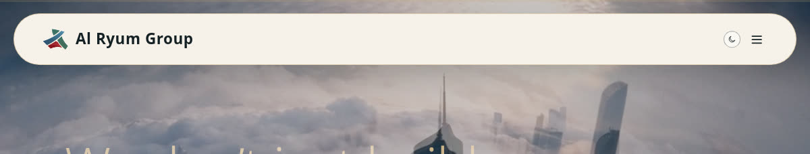
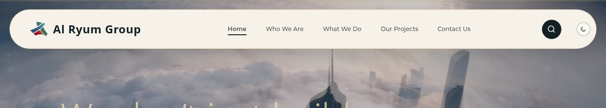

# Bug: the main menu disappears below 1280px, leaving the header pill looking empty

**Severity:** Medium-High — the primary navigation collapses to a hamburger on ordinary
laptop widths, and the header pill reads as an empty bar.
**Component:** the header nav breakpoint (`xl:` = 1280px) in the header markup.
**Verified by:** headless Chromium screenshots of the live build at 900 / 1000 / 1024 /
1100 / 1200 / 1280 / 1366 / 1440 / 1485 px, plus a Tailwind breakpoint audit of `app.css`.

---

## Symptom (as reported by the client)

> "the menu bar looks empty until I zoom out then the contents come"

## What is actually happening

The header's centre is empty because the **desktop navigation is hidden below 1280px**
and replaced by a hamburger icon. Zooming the browser out widens the **CSS viewport**,
which pushes it past 1280px, so the nav links reappear and seem to "come back".

It is not a rendering fault and nothing is overflowing. The pill is doing exactly what
its breakpoint tells it to do — the breakpoint is simply set too high for laptop screens.

## Evidence

**Below the breakpoint — blank centre, hamburger instead of links:**



**At the breakpoint — full five-link menu:**



Screenshots of the live build, one per width:

| CSS width | Navigation links | Hamburger | Header pill |
|-----------|------------------|-----------|-------------|
|  900 px   | absent           | present   | logo left, icons right, **blank middle** |
| 1000 px   | absent           | present   | logo left, icons right, **blank middle** |
| 1024 px   | absent           | present   | logo left, icons right, **blank middle** |
| 1100 px   | absent           | present   | logo left, icons right, **blank middle** |
| 1200 px   | absent           | present   | logo left, icons right, **blank middle** |
| 1280 px   | **present (5)**  | absent    | full menu |
| 1366 px   | **present (5)**  | absent    | full menu |
| 1440 px   | **present (5)**  | absent    | full menu |
| 1485 px   | **present (5)**  | absent    | full menu |

Every crop is in this folder: `header-900.jpg` … `header-1485.jpg`.
There is also an `index.html` in this folder that lays all nine out side by side —
open it locally to compare them in one view.

Breakpoint located in `assets/app.css`:

```
@media (min-width: 64rem)  /* 1024px */  ->  lg:flex
@media (min-width: 80rem)  /* 1280px */  ->  xl:flex, xl:hidden   <-- the nav switch
```

So the menu flips at **1280px**, not at 1024px.

## Why a 1366px laptop can still show the bug

The switch is on **CSS viewport width**, not window width. Anything that reduces the CSS
viewport below 1280px collapses the menu:

- a 1280px window, once browser chrome and the scrollbar are subtracted;
- **browser zoom** — a 1366px window at 110% is ~1242 CSS px, at 125% it is ~1093 CSS px,
  both below the switch;
- a 1440px window at 125% is ~1152 CSS px.

**This is the most likely trigger for the report**: the menu is missing at the user's
normal zoom, and zooming *out* restores it. That behaviour is the breakpoint, not a bug
in the scaling CSS.

## Suggested fix

Lower the nav's switch from `xl:` (1280) to `lg:` (1024), so the full menu survives
ordinary laptop widths and the hamburger is reserved for tablet/phone:

- change the desktop link container from `hidden xl:flex` to `hidden lg:flex`
- change the hamburger from `xl:hidden` to `lg:hidden`

Check the pill still fits at 1024–1100px once the five links return; if it is tight,
shorten the labels or reduce the pill's horizontal padding at `lg` rather than pushing
the switch back up.

## How to verify

1. Open the site at **1024, 1100, 1200, 1280 and 1366** px CSS width.
2. At every one of those widths, all five links (Home, Who We Are, What We Do,
   Our Projects, Contact Us) must be visible and the hamburger absent.
3. Repeat at **110% and 125% browser zoom** on a 1366 window.
4. Pass condition: no width or zoom at or above 1024px CSS shows a blank pill centre.

## Correction to an earlier report

An earlier version of this bug report claimed the cause was `zoom: 0.85` applied to
`header.fixed` in `al-ryum-desktop-scale.css`, and that it affected 1280/1366/1440.
**That was wrong on both counts and the report has been withdrawn.**

- The `scrollWidth / getBoundingClientRect().width == 1/zoom` ratio it used as proof is an
  expected artefact of CSS zoom: `scrollWidth` is reported in the element's own unscaled
  units while `getBoundingClientRect()` is in viewport pixels. The ratio is normal and
  proves nothing about overflow.
- Screenshots at 1280, 1366, 1440 and 1485 show the header rendering **correctly** with
  the full menu, so the impact claim was false.

The measured overflow at 1485px was in fact **-20px** (i.e. it fit).
